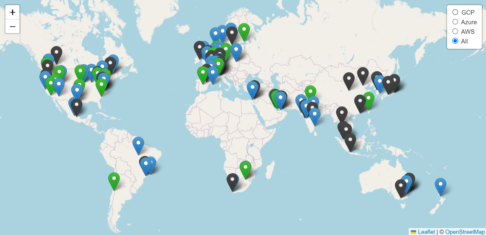

## AWS, Azure, GCP: Regions and Availability Zones

Last update: 15/01/2025

[full screen](README.md)

[Interactive map](https://cloudregionsmap.z6.web.core.windows.net/)

Contents:
[AWS](#aws) |
[Azure](#azure) |
[GCP](#gcp)

## Azure

name|displayName|city/state|zones|lon|lat
--- |--- |--- |--- |--- |--- |
southafricanorth|(Africa) South Africa North|Johannesburg|['southafricanorth-az3', 'southafricanorth-az2', 'southafricanorth-az1']|28.21837|-25.73134
southafricawest|(Africa) South Africa West|Cape Town||18.843266|-34.075691
australiacentral|(Asia Pacific) Australia Central|Canberra||149.1244|-35.3075
australiacentral2|(Asia Pacific) Australia Central 2|Canberra||149.1244|-35.3075
australiaeast|(Asia Pacific) Australia East|New South Wales|['australiaeast-az3', 'australiaeast-az2', 'australiaeast-az1']|151.2094|-33.86
australiasoutheast|(Asia Pacific) Australia Southeast|Victoria||144.9631|-37.8136
centralindia|(Asia Pacific) Central India|Pune|['centralindia-az3', 'centralindia-az2', 'centralindia-az1']|73.9197|18.5822
eastasia|(Asia Pacific) East Asia|Hong Kong|['eastasia-az3', 'eastasia-az2', 'eastasia-az1']|114.188|22.267
japaneast|(Asia Pacific) Japan East|Tokyo, Saitama|['japaneast-az3', 'japaneast-az2', 'japaneast-az1']|139.77|35.68
japanwest|(Asia Pacific) Japan West|Osaka||135.5022|34.6939
jioindiacentral|(Asia Pacific) Jio India Central|Nagpur||79.08886|21.146633
jioindiawest|(Asia Pacific) Jio India West|Jamnagar||70.05773|22.470701
koreacentral|(Asia Pacific) Korea Central|Seoul|['koreacentral-az3', 'koreacentral-az2', 'koreacentral-az1']|126.978|37.5665
koreasouth|(Asia Pacific) Korea South|Busan||129.0756|35.1796
newzealandnorth|(Asia Pacific) New Zealand North|Auckland|['newzealandnorth-az3', 'newzealandnorth-az2', 'newzealandnorth-az1']|174.76349|-36.84853
southindia|(Asia Pacific) South India|Chennai||80.1636|12.9822
southeastasia|(Asia Pacific) Southeast Asia|Singapore|['southeastasia-az3', 'southeastasia-az2', 'southeastasia-az1']|103.833|1.283
westindia|(Asia Pacific) West India|Mumbai||72.868|19.088
canadacentral|(Canada) Canada Central|Toronto|['canadacentral-az3', 'canadacentral-az2', 'canadacentral-az1']|-79.383|43.653
canadaeast|(Canada) Canada East|Quebec||-71.217|46.817
francecentral|(Europe) France Central|Paris|['francecentral-az3', 'francecentral-az2', 'francecentral-az1']|2.373|46.3772
francesouth|(Europe) France South|Marseille||2.1972|43.8345
germanynorth|(Europe) Germany North|Berlin||8.806422|53.073635
germanywestcentral|(Europe) Germany West Central|Frankfurt|['germanywestcentral-az3', 'germanywestcentral-az2', 'germanywestcentral-az1']|8.682127|50.110924
italynorth|(Europe) Italy North|Milan|['italynorth-az3', 'italynorth-az2', 'italynorth-az1']|9.18109|45.46888
northeurope|(Europe) North Europe|Ireland|['northeurope-az3', 'northeurope-az2', 'northeurope-az1']|-6.2597|53.3478
norwayeast|(Europe) Norway East|Norway|['norwayeast-az3', 'norwayeast-az2', 'norwayeast-az1']|10.752245|59.913868
norwaywest|(Europe) Norway West|Norway||5.733107|58.969975
polandcentral|(Europe) Poland Central|Warsaw|['polandcentral-az3', 'polandcentral-az2', 'polandcentral-az1']|21.01666|52.23334
spaincentral|(Europe) Spain Central|Madrid|['spaincentral-az3', 'spaincentral-az2', 'spaincentral-az1']|3.4209|40.4259
swedencentral|(Europe) Sweden Central|Gävle|['swedencentral-az3', 'swedencentral-az2', 'swedencentral-az1']|17.14127|60.67488
switzerlandnorth|(Europe) Switzerland North|Zurich|['switzerlandnorth-az3', 'switzerlandnorth-az2', 'switzerlandnorth-az1']|8.564572|47.451542
switzerlandwest|(Europe) Switzerland West|Geneva||6.143158|46.204391
uksouth|(Europe) UK South|London|['uksouth-az3', 'uksouth-az2', 'uksouth-az1']|-0.799|50.941
ukwest|(Europe) UK West|Cardiff||-3.084|53.427
westeurope|(Europe) West Europe|Netherlands|['westeurope-az3', 'westeurope-az2', 'westeurope-az1']|4.9|52.3667
mexicocentral|(Mexico) Mexico Central|Querétaro State|['mexicocentral-az3', 'mexicocentral-az2', 'mexicocentral-az1']|-100.389888|20.588818
israelcentral|(Middle East) Israel Central|Israel|['israelcentral-az3', 'israelcentral-az2', 'israelcentral-az1']|33.4506633|31.2655698
qatarcentral|(Middle East) Qatar Central|Doha|['qatarcentral-az3', 'qatarcentral-az2', 'qatarcentral-az1']|51.439327|25.551462
uaecentral|(Middle East) UAE Central|Abu Dhabi||54.366669|24.466667
uaenorth|(Middle East) UAE North|Dubai|['uaenorth-az3', 'uaenorth-az2', 'uaenorth-az1']|55.316666|25.266666
brazilsouth|(South America) Brazil South|Sao Paulo State|['brazilsouth-az3', 'brazilsouth-az2', 'brazilsouth-az1']|-46.633|-23.55
brazilsoutheast|(South America) Brazil Southeast|Rio||-43.2075|-22.90278
brazilus|(South America) Brazil US|||0|0
centralus|(US) Central US|Iowa|['centralus-az3', 'centralus-az2', 'centralus-az1']|-93.6208|41.5908
centraluseuap|(US) Central US EUAP|||-93.6208|41.5908
eastus|(US) East US|Virginia|['eastus-az3', 'eastus-az2', 'eastus-az1']|-79.8164|37.3719
eastus2|(US) East US 2|Virginia|['eastus2-az3', 'eastus2-az2', 'eastus2-az1']|-78.3889|36.6681
eastus2euap|(US) East US 2 EUAP||['eastus2euap-az3', 'eastus2euap-az2', 'eastus2euap-az1']|-78.3889|36.6681
eastusstg|(US) East US STG|Virginia||-79.8164|37.3719
northcentralus|(US) North Central US|Illinois||-87.6278|41.8819
southcentralus|(US) South Central US|Texas|['southcentralus-az3', 'southcentralus-az2', 'southcentralus-az1']|-98.5|29.4167
southcentralusstg|(US) South Central US STG|Texas||-98.5|29.4167
westcentralus|(US) West Central US|Wyoming||-110.234|40.89
westus|(US) West US|California||-122.417|37.783
westus2|(US) West US 2|Washington|['westus2-az3', 'westus2-az2', 'westus2-az1']|-119.852|47.233
westus3|(US) West US 3|Phoenix|['westus3-az3', 'westus3-az2', 'westus3-az1']|-112.074036|33.448376

 

## GCP

Region|Zones|Location|Continent
--- |--- |--- |--- |
africa-south1|['africa-south1-a', 'africa-south1-b', 'africa-south1-c']|Johannesburg| South Africa
asia-east1|['asia-east1-a', 'asia-east1-b', 'asia-east1-c']|Changhua County, Taiwan| APAC
asia-east2|['asia-east2-a', 'asia-east2-b', 'asia-east2-c']|Hong Kong| APAC
asia-northeast1|['asia-northeast1-a', 'asia-northeast1-b', 'asia-northeast1-c']|Tokyo, Japan| APAC
asia-northeast2|['asia-northeast2-a', 'asia-northeast2-b', 'asia-northeast2-c']|Osaka, Japan| APAC
asia-northeast3|['asia-northeast3-a', 'asia-northeast3-b', 'asia-northeast3-c']|Seoul, South Korea| APAC
asia-south1|['asia-south1-a', 'asia-south1-b', 'asia-south1-c']|Mumbai, India| APAC
asia-south2|['asia-south2-a', 'asia-south2-b', 'asia-south2-c']|Delhi, India| APAC
asia-southeast1|['asia-southeast1-a', 'asia-southeast1-b', 'asia-southeast1-c']|Jurong West, Singapore| APAC
asia-southeast2|['asia-southeast2-a', 'asia-southeast2-b', 'asia-southeast2-c']|Jakarta, Indonesia| APAC
australia-southeast1|['australia-southeast1-a', 'australia-southeast1-b', 'australia-southeast1-c']|Sydney, Australia| APAC
australia-southeast2|['australia-southeast2-a', 'australia-southeast2-b', 'australia-southeast2-c']|Melbourne, Australia| APAC
europe-central2|['europe-central2-a', 'europe-central2-b', 'europe-central2-c']|Warsaw, Poland| Europe
europe-north1|['europe-north1-a', 'europe-north1-b', 'europe-north1-c']|Hamina, Finland| Europe
europe-southwest1|['europe-southwest1-a', 'europe-southwest1-b', 'europe-southwest1-c']|Madrid, Spain| Europe
europe-west10|['europe-west10-a', 'europe-west10-b', 'europe-west10-c']|Berlin, Germany| Europe
europe-west12|['europe-west12-a', 'europe-west12-b', 'europe-west12-c']|Turin, Italy| Europe
europe-west1|['europe-west1-b', 'europe-west1-c', 'europe-west1-d']|St. Ghislain, Belgium| Europe
europe-west2|['europe-west2-a', 'europe-west2-b', 'europe-west2-c']|London, England| Europe
europe-west3|['europe-west3-a', 'europe-west3-b', 'europe-west3-c']|Frankfurt, Germany| Europe
europe-west4|['europe-west4-a', 'europe-west4-b', 'europe-west4-c']|Eemshaven, Netherlands| Europe
europe-west6|['europe-west6-a', 'europe-west6-b', 'europe-west6-c']|Zurich, Switzerland| Europe
europe-west8|['europe-west8-a', 'europe-west8-b', 'europe-west8-c']|Milan, Italy| Europe
europe-west9|['europe-west9-a', 'europe-west9-b', 'europe-west9-c']|Paris, France| Europe
me-central1|['me-central1-a', 'me-central1-b', 'me-central1-c']|Doha, Qatar| Middle East
me-central2|['me-central2-a', 'me-central2-b', 'me-central2-c']|Dammam, Saudi Arabia| Middle East
me-west1|['me-west1-a', 'me-west1-b', 'me-west1-c']|Tel Aviv, Israel| Middle East
northamerica-northeast1|['northamerica-northeast1-a', 'northamerica-northeast1-b', 'northamerica-northeast1-c']|Montréal, Québec| North America
northamerica-northeast2|['northamerica-northeast2-a', 'northamerica-northeast2-b', 'northamerica-northeast2-c']|Toronto, Ontario| North America
northamerica-south1|['northamerica-south1-a', 'northamerica-south1-b', 'northamerica-south1-c']|Queretaro, Mexico| North America
southamerica-east1|['southamerica-east1-a', 'southamerica-east1-b', 'southamerica-east1-c']|Osasco, São Paulo, Brazil| South America
southamerica-west1|['southamerica-west1-a', 'southamerica-west1-b', 'southamerica-west1-c']|Santiago, Chile| South America
us-central1|['us-central1-a', 'us-central1-b', 'us-central1-c', 'us-central1-f']|Council Bluffs, Iowa| North America
us-east1|['us-east1-b', 'us-east1-c', 'us-east1-d']|Moncks Corner, South Carolina| North America
us-east4|['us-east4-a', 'us-east4-b', 'us-east4-c']|Ashburn, Virginia| North America
us-east5|['us-east5-a', 'us-east5-b', 'us-east5-c']|Columbus, Ohio| North America
us-south1|['us-south1-a', 'us-south1-b', 'us-south1-c']|Dallas, Texas| North America
us-west1|['us-west1-a', 'us-west1-b', 'us-west1-c']|The Dalles, Oregon| North America
us-west2|['us-west2-a', 'us-west2-b', 'us-west2-c']|Los Angeles, California| North America
us-west3|['us-west3-a', 'us-west3-b', 'us-west3-c']|Salt Lake City, Utah| North America
us-west4|['us-west4-a', 'us-west4-b', 'us-west4-c']|Las Vegas, Nevada| North America
 

## AWS

*The script doesn't generate az info for opt-in-required regions. \
Look it up manually, or use `aws ec2 describe-availability-zones --region <region>` if you are opted in (otherwise getting AuthFailure).

| name|displayName|zones
--- |--- |--- |
af-south-1|Africa (Cape Town)|[]
ap-east-1|Asia Pacific (Hong Kong)|[]
ap-northeast-1|Asia Pacific (Tokyo)|['ap-northeast-1a', 'ap-northeast-1c', 'ap-northeast-1d']
ap-northeast-2|Asia Pacific (Seoul)|['ap-northeast-2a', 'ap-northeast-2b', 'ap-northeast-2c', 'ap-northeast-2d']
ap-northeast-3|Asia Pacific (Osaka)|['ap-northeast-3a', 'ap-northeast-3b', 'ap-northeast-3c']
ap-south-1|Asia Pacific (Mumbai)|['ap-south-1a', 'ap-south-1b', 'ap-south-1c']
ap-south-2|Asia Pacific (Hyderabad)|[]
ap-southeast-1|Asia Pacific (Singapore)|['ap-southeast-1a', 'ap-southeast-1b', 'ap-southeast-1c']
ap-southeast-2|Asia Pacific (Sydney)|['ap-southeast-2a', 'ap-southeast-2b', 'ap-southeast-2c']
ap-southeast-3|Asia Pacific (Jakarta)|[]
ap-southeast-4|Asia Pacific (Melbourne)|[]
ap-southeast-5|Asia Pacific (Malaysia)|[]
ap-southeast-7|Asia Pacific (Thailand)|[]
ca-central-1|Canada (Central)|['ca-central-1a', 'ca-central-1b', 'ca-central-1d']
ca-west-1|Canada West (Calgary)|[]
cn-north-1|China (Beijing)|[]
cn-northwest-1|China (Ningxia)|[]
eu-central-1|Europe (Frankfurt)|['eu-central-1a', 'eu-central-1b', 'eu-central-1c']
eu-central-2|Europe (Zurich)|[]
eu-north-1|Europe (Stockholm)|['eu-north-1a', 'eu-north-1b', 'eu-north-1c']
eu-south-1|Europe (Milan)|[]
eu-south-2|Europe (Spain)|[]
eu-west-1|Europe (Ireland)|['eu-west-1a', 'eu-west-1b', 'eu-west-1c']
eu-west-2|Europe (London)|['eu-west-2a', 'eu-west-2b', 'eu-west-2c']
eu-west-3|Europe (Paris)|['eu-west-3a', 'eu-west-3b', 'eu-west-3c']
il-central-1|Israel (Tel Aviv)|[]
me-central-1|Middle East (UAE)|[]
me-south-1|Middle East (Bahrain)|[]
mx-central-1|Mexico (Central)|[]
sa-east-1|South America (São Paulo)|['sa-east-1a', 'sa-east-1b', 'sa-east-1c']
us-east-1|US East (N. Virginia)|['us-east-1a', 'us-east-1b', 'us-east-1c', 'us-east-1d', 'us-east-1e', 'us-east-1f']
us-east-2|US East (Ohio)|['us-east-2a', 'us-east-2b', 'us-east-2c']
us-west-1|US West (N. California)|['us-west-1a', 'us-west-1c']
us-west-2|US West (Oregon)|['us-west-2a', 'us-west-2b', 'us-west-2c', 'us-west-2d']
                      

 
